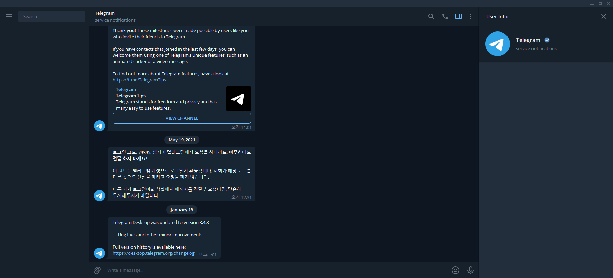

# 교육용 과제 3
주어진 API를 사용하여 멋진 웹 채팅 어플리케이션을 만들어보자



<br>

## 1. 필수과제
### 1-1. 환경
**구현해야하는 환경 입니다. 아래 라이브러리를 제외한 타 라이브러리를 사용하지 마세요.**

---------------------------------
- typescript + react(혹은 preact) + scss
- (선택)bootstrap(react-bootstarp 은 허용하지 않음)
- (선택)react-router
- (선택)redux 같은 상태관리 라이브러리

<br>

### 1-2. 화면
**구현해야하는 화면 목록입니다. PC 1920px-1200px, Tablet 1200px-768px, Mobile 768px-360px 기준으로 작업해주세요.**

---------------------------------
- 채팅방 진입 전 ID및 사용자명을 입력받는 화면
- 채팅방 목록 화면
- 실제로 상호간 사용가능한 채팅 화면

<br>

### 1-3. 기능
**구현해야하는 기능 목록입니다.**

-------------------------------
- 로그인
   + DB에 로그인정보를 저장하지 않습니다. 기본입력창으로 입력만받고 페이지 내부에 저장하세요.
- 채팅방목록
    + DB에 채팅방목록을 저장하지 않습니다. 정적 채팅방을 생성해주세요.
- 기본 채팅기능 (텍스트채팅, 파일업로드채팅)
- 사용자 차단 및 차단 해제
- 사용자 차단목록 표출
- 현재방에 접속한 유저 리스트 노출
- 유저 채팅 input 이벤트 감지
- 입장시 이전 채팅정보 유지
- 다크모드 처리(localStorage 저장)

<br>

### 1-4. 규칙
---------------------------------

1. typescript
   + any 타입 사용금지
   + inline interface 사용 금지

<br>

## 2. 서버 실행방법
```bash
# package.json에 정의된 라이브러리를 다운받습니다.
npm install

# dist/index.js 파일을 실행합니다.
npm run serve
```

<br>

### 2-1. 서버 연동
```typescript
// rest api 를 요청합니다.
fetch("http://localhost:8443/block")
	.then((data) => console.log(data));

// socekt 서버와 연결합니다.
const ws = new WebSocket("ws://localhost:8444/{roomid}/{idx}/{name}");
```
```html
<!-- 서버에 업로드된 이미지를 가져옵니다. -->

```
<br>

## 3. API 목록

<br>

### 3-1. RestAPI

| URI                                | Method | Parameter                  | Header              | return                                                       | Error |
|------------------------------------|--------|----------------------------|---------------------|--------------------------------------------------------------|--------|
| /checked                             | GET    | idx: number                |                     | { checked: true \| false }                                     | { error: string } |
| /chatlist                          | GET    | roomid: number             |                     | Array<{type: string, idx: number, name: string, message: string}> | { error: string } |
| /userlist                          | GET    | roomid?: number            |                     | Array<{idx: number, name: string}>                                | { error: string } |
| /blocklist                         | GET    | idx: number                |                     | Array<{idx: number, target: number}>                              | { error: string } |
| /block                             | GET    | idx: number target: number |                     | {}                                                           | { error: string } |
| /unlock                            | GET    | idx: number target: number |                     | {}                                                           | { error: string } |
| /upload/(filename).(jpg\|png\|gif) | GET    |                            |                     |                                                              |  |
| /upload                            | POST   | file: Boolean              | multipart/form-data | {upload: string}                                             | { error: string } |

<br>

### 3-2. socket
**파라미터는 JSON String 형식으로 넘겨주세요**

| type    | Parameter                      | return                                             |
|---------|--------------------------------|----------------------------------------------------|
| write   | event: write                   | {type, idx: number, name: string, message: string} |
| message | event: message message: string | {type, idx: number, name: string, message: string} |
| unwrite | event: unwrite                 | {type, idx: number, name: string, message: string} |
| open    |                                | {type, idx: number, name: string, message: string} |
| close   |                                | {type, idx: number, name: string, message: string} |

<br>

## 4. 제출방식
- 비공개 깃프로젝트 생성 후 프론트 담당자를 초대해주세요.
- 퇴근전에는 반드시 금일 작업내용을 remote 에 올려주세요.
- 최종완성본은 일정에 따라 코드리뷰가 진행될 예정입니다.
- 기한은 기본 2주이며 최대 4주까지 연장됩니다. 기한연장이 필요할 시 담당자에게 과제만료 3일전에 보고해주세요.
- 백엔드 코드에 문제가 있을 경우, 이슈트래커에 작성한뒤에 구두로 보고해주세요.
